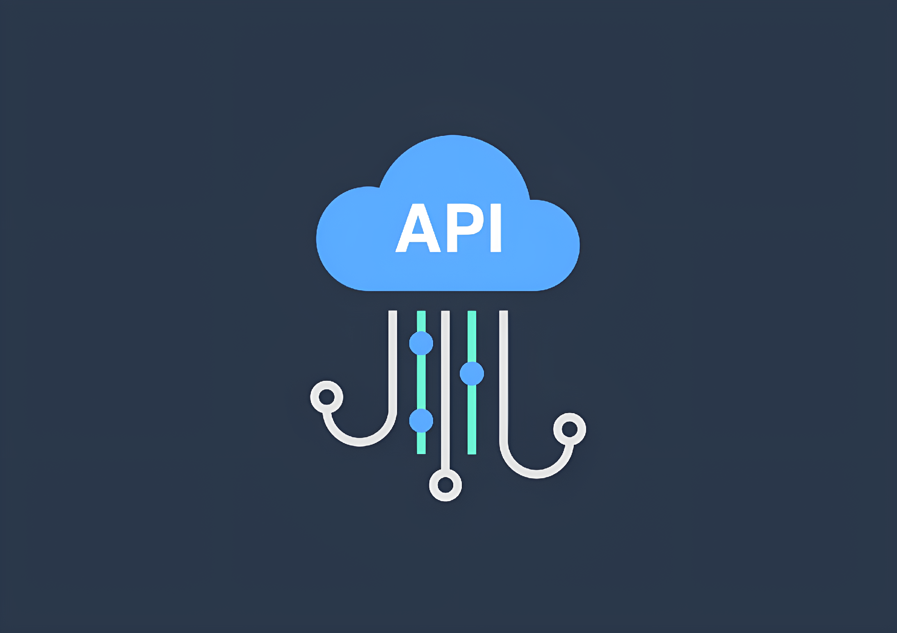

    

~~~
SimpleAutoTestApi/
├── api/
│   ├── __init__.py
│   ├── endpoints/
│   │   ├── ...
│   ├── schemas/
│   │   ├── ...
│   ├── models/
│   │   ├── ...
├── tests/
│   ├── ...
├── config/
│   ├── settings.py
~~~